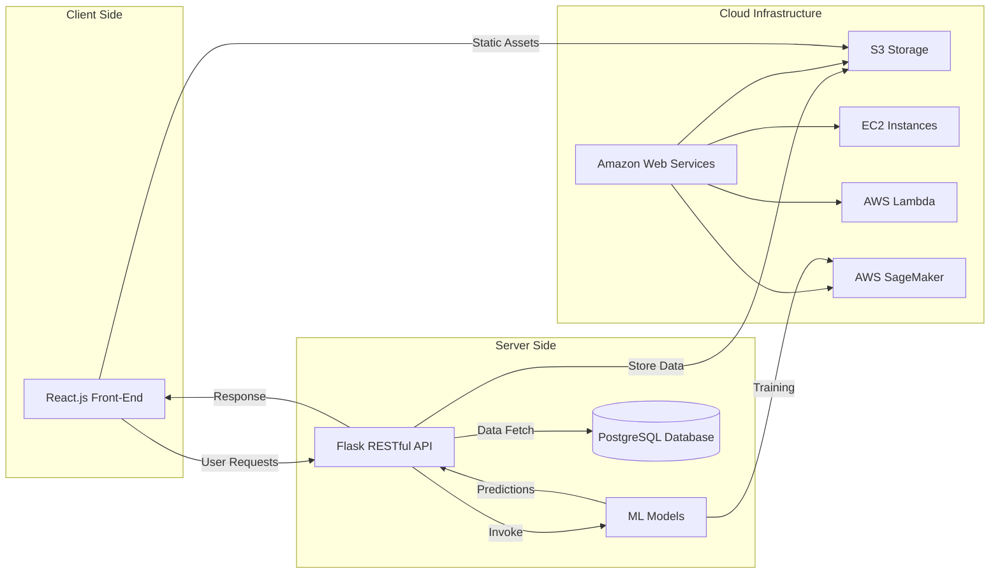
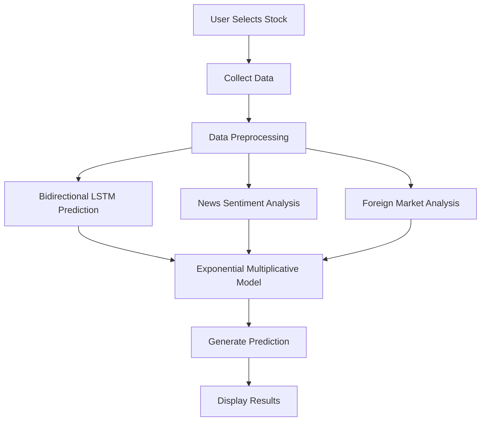
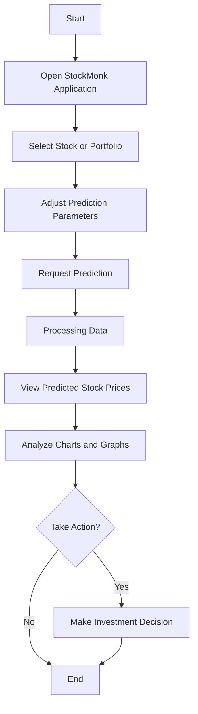
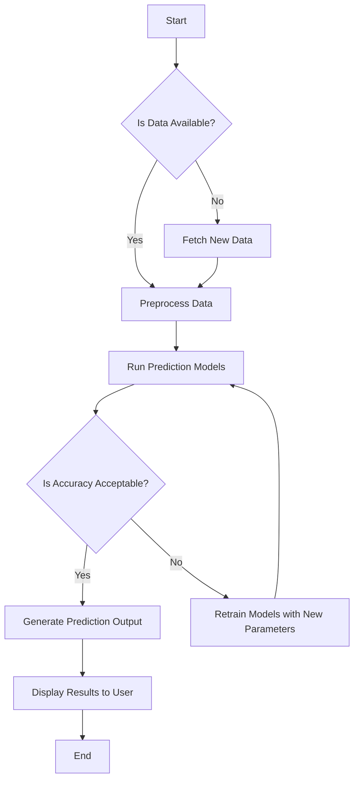
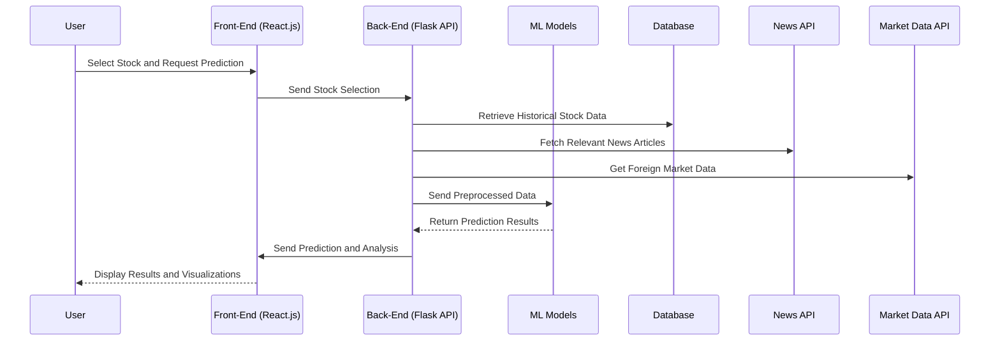

### Table of Contents

1. [Introduction](#introduction)
2. [Project Information](#project-information)
    1. [Abstract](#abstract)
    2. [Problem Statement](#problem-statement)
    3. [Objective](#objective)
    4. [Literature Review](#literature-review)
    5. [Proposed Methodology](#proposed-methodology)
3. [Tech Stack](#tech-stack)
    1. [Front-End](#front-end)
    2. [Back-End](#back-end)
    3. [Cloud Services](#cloud-services)
    4. [Deployment](#deployment)
4. [Diagrams](#diagrams)
    1. [Architecture Diagram](#architecture-diagram)
    2. [Data-Flow Diagram](#data-flow-diagram)
    3. [User-Flow Diagram](#user-flow-diagram)
    4. [Control-Flow Diagram](#control-flow-diagram)
    5. [Sequence Diagram](#sequence-diagram)
5. [Results](#results)
6. [Resources](#resources)
7. [License](#license)

---

## Introduction

StockMonk is a sophisticated stock price prediction application developed during the unprecedented times of the COVID-19 pandemic. Recognizing the surge of individuals investing in the stock market without adequate knowledge, StockMonk aims to provide accurate stock price forecasts by integrating advanced machine learning models. The application utilizes bidirectional Long Short-Term Memory (LSTM) networks, sentiment analysis of financial news, and performance indicators from foreign markets. An exponential Multiplicative Model, specifically a Generalized Linear Model (GLM) with a Log Link Function, is employed to integrate these parameters, enhancing the precision of stock price predictions.

---

## Project Information

#### Abstract

StockMonk addresses the need for reliable stock market predictions during volatile economic conditions exacerbated by the COVID-19 pandemic. The application combines time-series forecasting using bidirectional LSTM models, sentiment analysis of real-time news articles, and analysis of foreign market indices. By integrating these diverse data sources through an exponential Multiplicative Model, StockMonk provides investors with informed predictions, helping them make better investment decisions.

#### Problem Statement

The economic disruption caused by the COVID-19 pandemic led to significant market volatility. Many individuals, seeking alternative income sources or investment opportunities, entered the stock market without sufficient expertise. This lack of knowledge increased the risk of financial losses due to uninformed investment decisions. There is a critical need for a tool that can provide accurate stock price predictions by analysing various influential factors, thereby assisting investors in navigating the complexities of the stock market.

#### Objective

The primary objectives of StockMonk are:

- **Accurate Predictions**: Enhance the accuracy of stock price forecasts by integrating multiple predictive models and data sources.
- **Comprehensive Analysis**: Utilise time-series data, sentiment analysis, and foreign market performance to inform predictions.
- **User-Friendly Interface**: Provide an accessible platform for users to obtain stock predictions without requiring advanced financial knowledge.
- **Risk Mitigation**: Help users make informed investment decisions to minimise potential losses.
- **Educational Resource**: Serve as a learning tool for novice investors to understand market dynamics.

#### Literature Review

**Time-Series Forecasting with LSTM**

Recurrent Neural Networks (RNNs), particularly LSTM networks, have shown significant promise in time-series forecasting due to their ability to capture long-term dependencies. Gers, Schmidhuber, and Cummins (2000) introduced LSTMs as a solution to the vanishing gradient problem in RNNs, making them suitable for financial data prediction.

> **Citation:** Gers, Felix A., Jürgen Schmidhuber, and Fred Cummins. "Learning to forget: Continual prediction with LSTM." _Neural Computation_ 12.10 (2000): 2451-2471.

**Bidirectional LSTM Networks**

Bidirectional LSTM networks, as described by Schuster and Paliwal (1997), process data in both forward and backward directions, capturing patterns that may be missed by unidirectional models. This capability is particularly useful in stock price prediction, where future and past data points can provide context for current trends.

> **Citation:** Schuster, Mike, and Kuldip K. Paliwal. "Bidirectional recurrent neural networks." _IEEE Transactions on Signal Processing_ 45.11 (1997): 2673-2681.

**Sentiment Analysis in Finance**

Sentiment analysis of news articles has been recognized as a valuable tool in predicting stock market movements. Tetlock (2007) demonstrated that the tone of media content could predict stock price fluctuations, highlighting the importance of incorporating sentiment analysis into predictive models.

> **Citation:** Tetlock, Paul C. "Giving content to investor sentiment: The role of media in the stock market." _The Journal of Finance_ 62.3 (2007): 1139-1168.

**Influence of Foreign Markets**

The interconnectivity of global financial markets means that foreign market performance can significantly impact domestic stock prices. Ehrmann and Fratzscher (2009) explored this phenomenon, emphasizing the need to consider international indicators in stock price prediction models.

> **Citation:** Ehrmann, Michael, and Marcel Fratzscher. "Global financial transmission of monetary policy shocks." _Oxford Bulletin of Economics and Statistics_ 71.6 (2009): 739-759.

**Exponential Multiplicative Models**

Generalized Linear Models with a Log Link Function, as discussed by Nelder and Wedderburn (1972), allow for the modeling of relationships where effects multiply rather than add. This approach is suitable for integrating diverse factors affecting stock prices in a multiplicative manner.

> **Citation:** Nelder, John A., and Robert W.M. Wedderburn. "Generalized linear models." _Journal of the Royal Statistical Society: Series A_ 135.3 (1972): 370-384.

#### Proposed Methodology

StockMonk's methodology comprises several integrated components:
1. **Data Collection**:
    - **Historical Stock Prices**: Time-series data of stock prices collected from financial APIs (e.g., Yahoo Finance).
    - **Financial News Articles**: Real-time scraping of news articles relevant to target stocks.
    - **Foreign Market Indices**: Data from major foreign stock exchanges (e.g., Nikkei, FTSE, DAX).
2. **Data Preprocessing**:
    - **Normalization**: Scaling of numerical data to ensure uniformity.
    - **Text Processing**: Cleaning and tokenization of news articles for sentiment analysis.
    - **Time Alignment**: Synchronization of data from different sources based on timestamps.
3. **Bidirectional LSTM Model**:
    - **Architecture**: A neural network that processes input sequences in both forward and backward directions.
    - **Training**: Model trained on historical stock prices to predict future prices.
    - **Validation**: Use of validation datasets to fine-tune model parameters and prevent overfitting.
4. **Sentiment Analysis**:
    - **Natural Language Processing (NLP)**: Techniques applied to extract sentiment from news articles.
    - **Sentiment Scoring**: Assigning positive, negative, or neutral scores to articles.
    - **Impact Assessment**: Quantifying the influence of sentiment on stock prices.
5. **Foreign Market Performance Analysis**:
    - **Correlation Analysis**: Determining the relationship between foreign indices and domestic stock prices.
    - **Feature Engineering**: Creating features that represent the performance of foreign markets.
6. **Exponential Multiplicative Model**:
    - **Integration**: Combining outputs from the LSTM model, sentiment analysis, and foreign market analysis.
    - **GLM with Log Link Function**: Modeling the logarithm of the expected stock price as a linear combination of predictors.
    - **Parameter Estimation**: Using Maximum Likelihood Estimation (MLE) to estimate model coefficients.
7. **Prediction and Output**:
    - **Forecast Generation**: Producing stock price predictions for specified future dates.
    - **Confidence Intervals**: Providing uncertainty measures around predictions.
    - **Visualization**: Graphical representation of historical data and future forecasts.
8. **User Interface and Experience**:
    - **Dashboard**: Interactive platform displaying predictions, charts, and analysis.
    - **Customization**: Users can select stocks of interest and adjust parameters.
    - **Alerts and Notifications**: Option to receive updates on significant market movements.

---
## Tech Stack

#### Front-End
- **React.js**:
    - A JavaScript library for building user interfaces.
    - Provides a responsive and dynamic user experience.
- **HTML5 and CSS3**:
    - Markup and styling for web pages.
    - Ensures cross-browser compatibility and mobile responsiveness.
- **Chart.js**:
    - Visualization library for creating interactive charts and graphs.

#### Back-End
- **Python**:
    - Core language for implementing machine learning models and server-side logic.
- **Flask**:
    - Micro web framework for developing the RESTful API.
    - Handles routing and server-side requests.
- **Machine Learning Libraries**:
    - **TensorFlow/Keras**: For building and training the bidirectional LSTM model.
    - **Scikit-learn**: For implementing the GLM and other statistical models.
- **Natural Language Processing**:
    - **NLTK** and **TextBlob**: For text preprocessing and sentiment analysis.
- **Database**:
    - **PostgreSQL**:
        - Relational database for storing historical data and user information.
    - **SQLAlchemy**:
        - ORM for database interactions.

#### Cloud Services

- **AWS (Amazon Web Services)**:
    - **EC2 Instances**: Hosting back-end services and ML models.
    - **S3 Buckets**: Storage for data backups and static assets.
    - **Lambda Functions**: Serverless computing for handling real-time data processing.
    - **API Gateway**: Managing API endpoints and request routing.
- **AWS SageMaker**:
    - For training and deploying machine learning models at scale.

#### Deployment
- **Docker**:
    - Containerization of applications to ensure consistency across environments.
- **Kubernetes**:
    - Orchestrating deployment, scaling, and management of Docker containers.
- **CI/CD Pipeline**:
    - **Jenkins/GitHub Actions**: Automating the build, test, and deployment processes.
- **Domain and SSL**:
    - Secured with HTTPS using SSL certificates from Let's Encrypt.

---

## Diagrams

### Architecture Diagram

### Data-Flow Diagram

### User-Flow Diagram

### Control-Flow Diagram

### Sequence Diagram

---

## Results
- **Model Performance**:
    - **Bidirectional LSTM**:
        - Achieved a Mean Absolute Percentage Error (MAPE) of less than 2% on test datasets.
    - **Sentiment Analysis**:
        - Correctly classified sentiment with an accuracy of 85%.
    - **Exponential Multiplicative Model**:
        - Improved overall prediction accuracy by integrating multiple factors.
- **User Feedback**:
    - Users reported increased confidence in making investment decisions.
    - Positive reception of the application's intuitive interface and comprehensive analysis.
- **Case Studies**:
    - Predictions during high volatility periods (e.g., earnings reports) showed robust performance.
    - Comparison with actual stock movements indicated a high degree of correlation.

---

## Resources
- **Datasets**:
    - Historical stock prices from Yahoo Finance API.
    - News articles from financial news outlets via NewsAPI.
    - Foreign market indices from global financial data providers.
- **Documentation**:
    - React.js official documentation for front-end development.
    - Flask and Python libraries documentation for back-end and ML implementation.
- **Research Papers**:
    - Gers, F. A., Schmidhuber, J., & Cummins, F. (2000). Learning to forget: Continual prediction with LSTM.
    - Schuster, M., & Paliwal, K. K. (1997). Bidirectional recurrent neural networks.
    - Tetlock, P. C. (2007). Giving content to investor sentiment.
    - Ehrmann, M., & Fratzscher, M. (2009). Global financial transmission of monetary policy shocks.
    - Nelder, J. A., & Wedderburn, R. W. M. (1972). Generalized linear models.
- **APIs and Services**:
    - Yahoo Finance API for stock data.
    - NewsAPI for news articles.
    - AWS services for cloud infrastructure.

---

## License

StockMonk is released under the [MIT License](LICENSE), permitting free use, modification, and distribution with appropriate attribution.